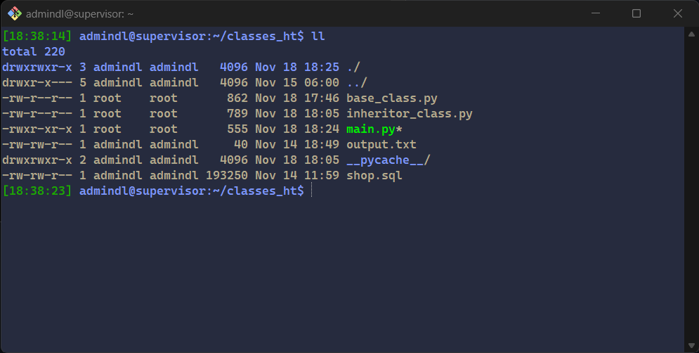
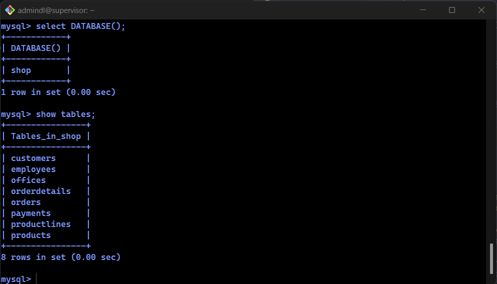
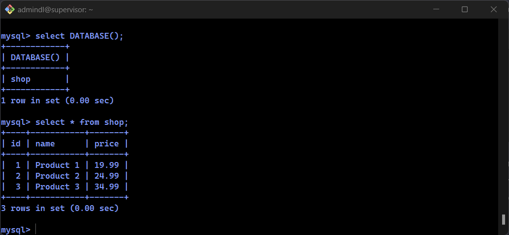
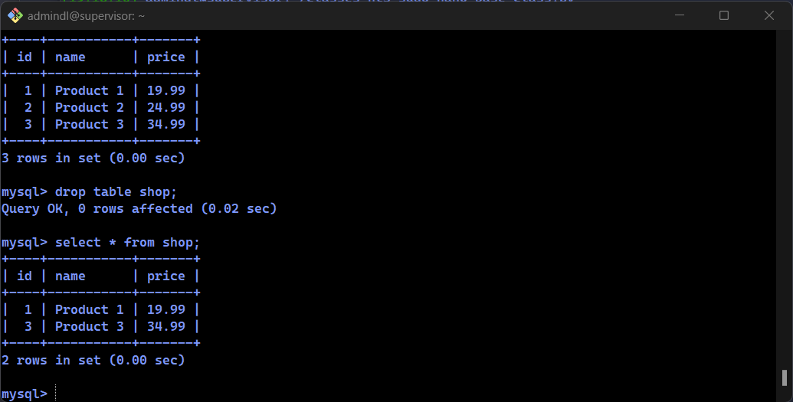
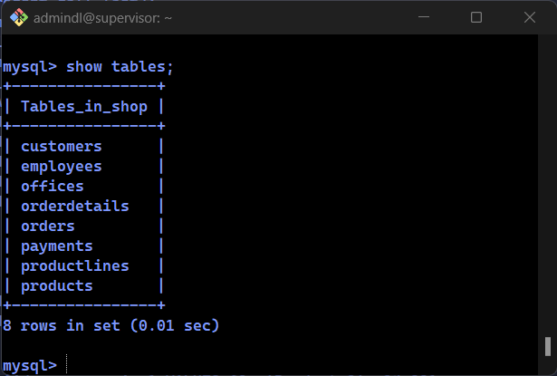

* (the "fetchall()" method does not used)
* my test environment

* table shop does not exist in current test database

* the "shop" is created

* the result after del_item() function ran

* nable deleted from DB after main.py fulfiled

