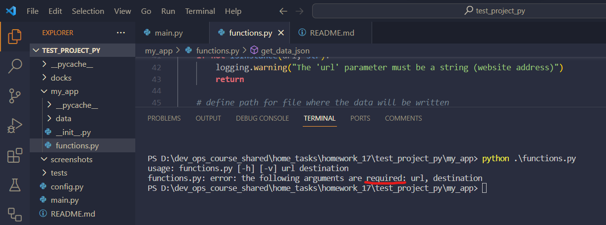
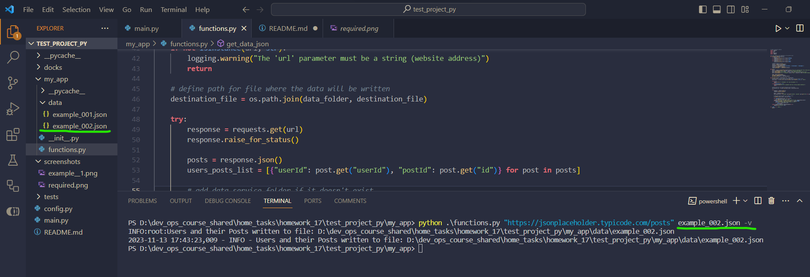
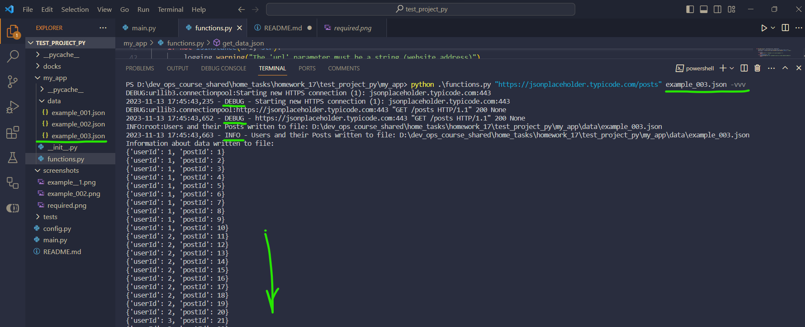

* `test_project_python/my_app/functions.py` is includes the set of functions
* `test_project_python/main.py` imports the required function from `test_project_python/my_app/functions.py`
* when a function `get_data_json()` is running in a file, debugging information is not displayed in the console

