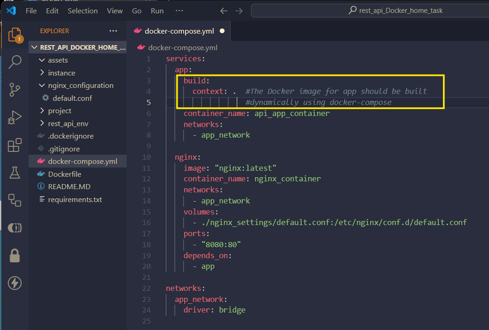
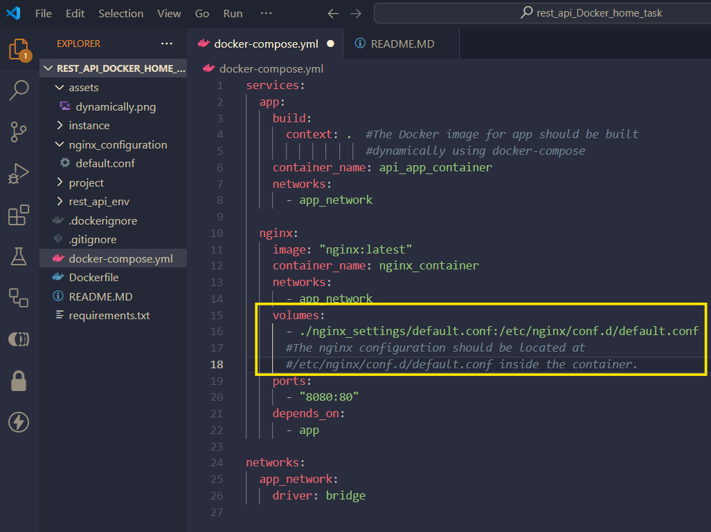
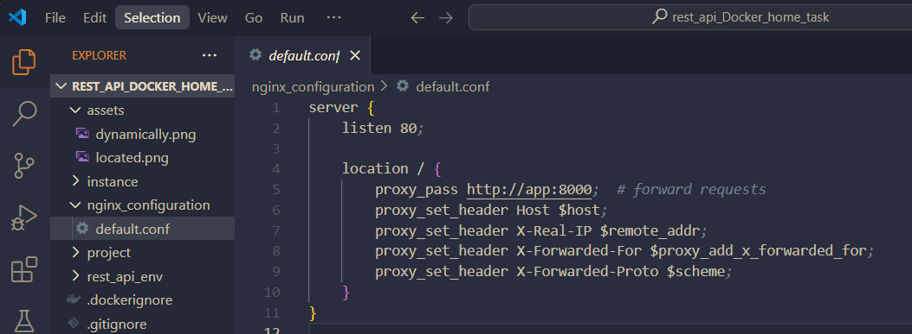
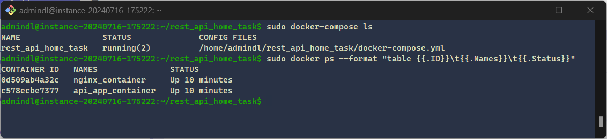
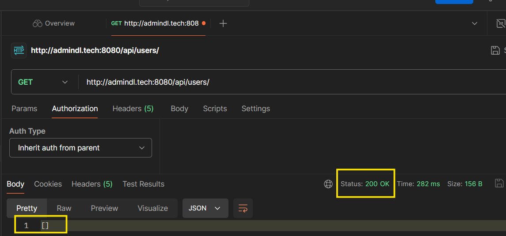
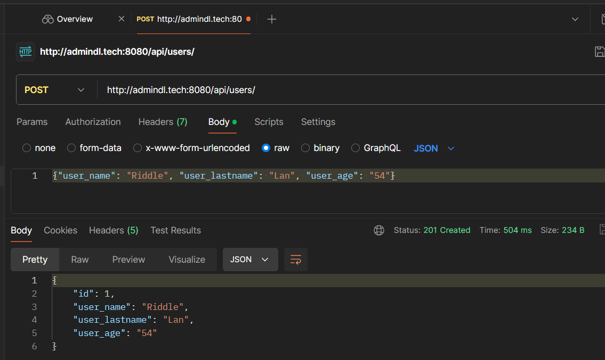
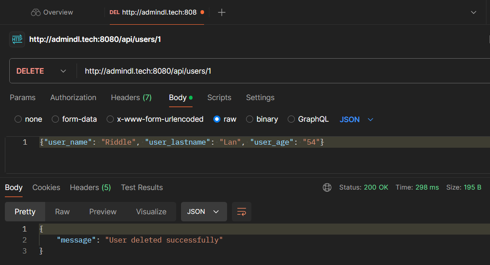

# The Docker image for app is built dynamically using docker-compose.

#  The nginx configuration should be located at /etc/nginx/conf.d/default.conf inside the container.

# nginx configuration file

# It works on gcp

